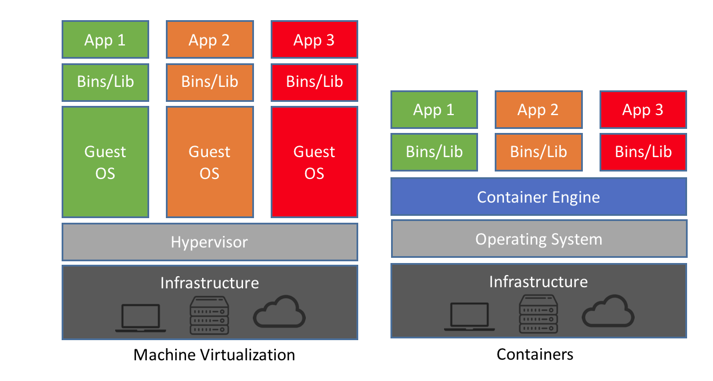

# Overview of Containers

!!! clipboard-list "Lesson Objectives"

    - Know what a container is
    - Understand why you would want to use a container
    - Know about Apptainer, which we will be using for this workshop

In this section, we will introduce what a container is and why you would want to use a container.

## What is a Container?

A container is a way to package and run software so that it behaves consistently across different machines.

At a high level, a container bundles:
* Your application
* Its dependencies (libraries, runtimes, tools)
* Its expected filesystem layout (where binaries/configs live)
* Sometimes: environment variables and default execution behavior

If you’ve ever had “it works on my laptop” problems, containers are designed to reduce that by shipping a self-contained runtime environment.

### Containers vs Virtual Machines (VMs)

Containers are often compared to Virtual Machines (VMs):

* Virtual Machine: Packages a full OS + kernel + virtual hardware
* Container: Packages user-space software and libraries, but typically shares the host kernel

For this reason, containers are usually:

* Lighter weight to run (less CPU and memory usage, faster start-up times)
* Smaller in size (thus easier to transfer and share)
* Modular (possible to combine multiple containers that work together)

## Why would you want to use a Container?

The reasons you would want to use a container are:

* Reproducibility: You can define an environment once and run the same stack elsewhere and get same results. This is particularly valuable for:
    * Scientific workflows
    * Published results
    * Long-running projects where the “right” environment changes over time
* Portability: You can transfer a container to any computer or HPC and it should generally work without having to go through "dependency hell"
* Some Isolation: The software contained in the container generally see its own software stack only and will not see software outside the container. 
* Dependancy Management: Everything you need is installed inside the container.

## What is Apptainer?

Apptainer (formerly Singularity) is a container platform heavily used in HPC. Its design goals differ from Docker in ways that matter on shared clusters. 

The key characteristics of Apptainer are:

* Runs as the calling user:
    * You typically do not need root to run containers.
    * There’s no always-running privileged service like Docker’s daemon model.
* Integrates with HPC environments. Designed to play nicely with:
    * shared filesystems
    * SLURM job launches
    * MPI stacks (host MPI + container environment)
    * GPU passthrough (e.g., NVIDIA)
* “Bring your own environment, use the host resources”
    * You can ship user-space dependencies (life software)
    * While still using host drivers and hardware capabilities.

## Takeaway points

!!! graduation-cap "What you take away from this overview"

    - Containers are a way to package and run software such that it behaves consistently across different machines
    - Containers allows for reproducibility, portability, isolation between software stacks, and dependancy management. 
    - Apptainer is a program that allows you to run and build containers

