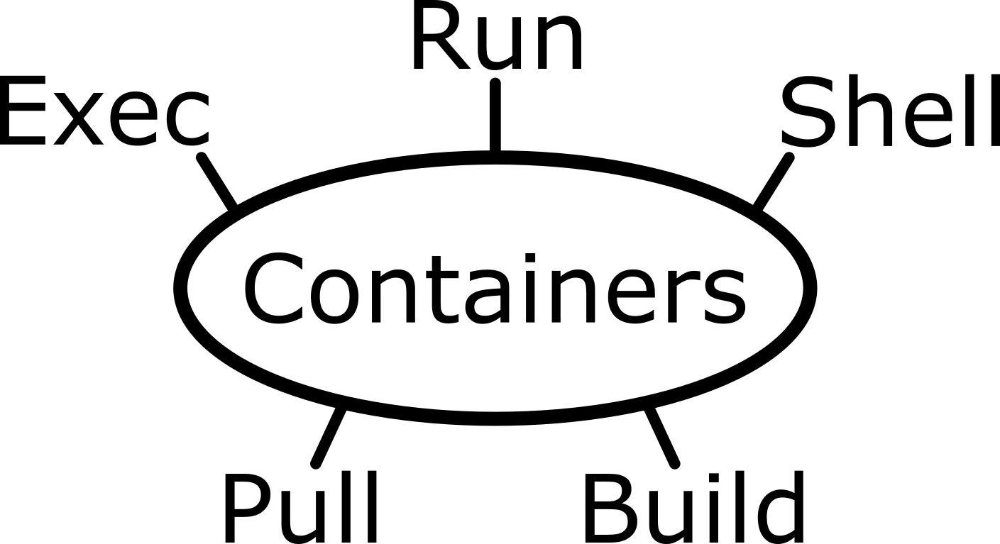

# Introduction to Containers on High Perforance Clusters (HPC)

{: width="500px" .center}

| **Lesson**                                         | **Overview** | 
|:---------------------------------------------------|:-------------|
|Pre . [Unix, Linux and UNIX Shell](./0-unixl-linux-overview.md)|Quick overview on UNIX operating system and it's importance|
|1. [Introducing the shell](./01-introduction.md)| Introduce `cd` `ls`  |
|2. [Navigating files and directories](./02-the-filesystem.md)| moving around the filesystem. Introduce absolute vs relative path |
|3. [Working with files and directories](./03-working-with-files.md)| View, search within, copy, move, and rename files. Create new directories |
|4. [Redirection](./04-redirection.md)| Employ the grep command to search for information within files | 
|5. [Writing scripts and working with data](./05-writing-scripts.md)| How to use a terminal based text editor | 
|6. [Project Organisation](./06-organization.md)| Create a file system for a bioinformatics project | 

!!! plane-depart "Getting Started"

    This lesson assumes no prior experience with the tools covered in the workshop.
    However, learners are expected to have some familiarity with biological concepts,
    including the
    concept of genomic variation within a population. Participants should bring their laptops and plan to participate actively.

- - - 

!!! copyright "Attribution Notice"

    * This workshop material is adapted  and inspired by The Carpentries [Data Carpentry - Shell Genomics](https://datacarpentry.org/shell-genomics/)
 

!!! key "License" 

    Genomics Aotearoa / REANNZ "Introduction to Shell for Bioinformatics" is licensed under the **GNU General Public License v3.0, 29 June 2007** . ([Follow this link for more information](https://github.com/GenomicsAotearoa/introduction-to-shell/blob/main/LICENSE))